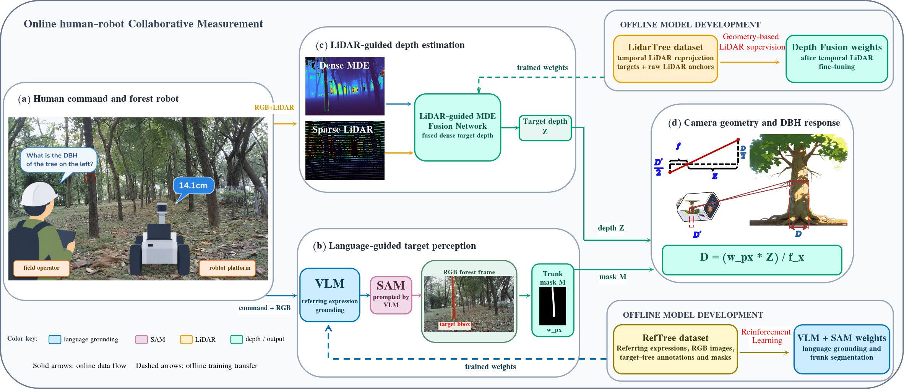

# XFuse-DBH

**Evidence-gated RGB–LiDAR depth fusion for language-guided tree DBH measurement**

Official training and evaluation code for the depth stage of *Language-Guided Tree DBH
Measurement with Evidence-Gated RGB-LiDAR Depth Fusion*.

The complete measurement chain is shown below: an operator specifies the target tree with a
referring expression, a vision-language model with a frozen segmenter produces the trunk mask,
the depth branch returns dense metric depth, and the mask — never the network — defines the
fixed pinhole read-out region from which the diameter is computed.



**This repository contains the depth branch, XFuse-DBH.** It pairs a dense monocular depth prior
with sparse, platform-mounted LiDAR. A frozen conditioned DINOv2/DPT backbone supplies
continuous scene geometry, while four trainable **support-gated cross-attention (SG-CA)** blocks
inject projected LiDAR evidence at every DPT decoder scale. The decoder emits disparity directly
— the model never multiplies a base prediction by a learned correction, and the projection in
each fusion block is zero-initialized, so loading the released prior-conditioned weights
reproduces them exactly before training.

The fusion module is trained **without DBH labels and without trunk masks**, supervised only by
target-frame-excluded temporal reprojection, raw LiDAR anchors and consistency with the frozen
dense prior.


---

## Main results

DBH accuracy on the 50 tape-measured held-out stems (evaluation sequences 00–04, 1.3 m band,
±0.05 m slice, fixed pinhole read-out geometry shared by every depth source).

| Depth source | Stems measured | MAE (cm) | RMSE (cm) | Median abs. error (cm) |
|---|---|---|---|---|
| Raw sparse LiDAR projection | 38 / 50 | 8.66 | 17.08 | 1.30 |
| Coarse global alignment | 50 / 50 | 1.84 | 2.67 | 1.20 |
| Coarse + KNN alignment | 50 / 50 | 1.38 | 1.87 | 1.00 |
| Pretrained dense prior (frozen PriorDA) | 50 / 50 | 1.23 | 1.63 | 1.02 |
| **XFuse-DBH (ours)** | **50 / 50** | **1.10** | **1.47** | **0.89** |

Paired contrast **XFuse-DBH − pretrained dense prior**: ΔMAE = **−0.125 cm**, frame-clustered
95 % percentile bootstrap interval **[−0.285, −0.004]** (2000 resamples, whole frames as
clusters, 38 clusters), 27 stems improved and 23 worsened. Because stems recorded in the same
frame share a pose, a LiDAR projection and an occlusion pattern, the frames are the resampling
unit and the interval excludes zero.

*(a) Ground-truth DBH of the 50 stems; the red segments are the 12 stems with no valid LiDAR
return inside the 1.3 m band. (b) Absolute DBH error against stem size for the pretrained
baseline (circles) and XFuse-DBH (squares).*


## Repository layout

```
XFuse-DBH/
├── prior_lidar/                          # core library
│   ├── __init__.py
│   ├── alignment.py                      # robust metric alignment of the LiDAR prior
│   ├── conditions.py                     # prior-conditioned three-channel condition tensor
│   ├── data.py                           # cache schemas and temporal datasets
│   ├── direct_fusion.py                  # XFuse-DBH: SG-CA blocks + direct disparity decoder
│   ├── model.py                          # frozen PriorDA DINOv2/DPT wrapper
│   ├── metrics.py                        # depth metrics
│   ├── pipeline.py                       # single-frame inference helper
│   ├── temporal.py                       # temporal LiDAR cache utilities
│   └── temporal_reliability.py           # leakage-free temporal confidence targets
├── depth_anything_v2/                    # conditioned DINOv2/DPT backbone (see Acknowledgements)
│   ├── dpt.py, dinov2.py, __init__.py
│   ├── dinov2_layers/
│   └── util/
├── tools/
│   ├── train_prior_lidar_direct_fusion.py    # training entry point
│   ├── eval_prior_lidar_direct_fusion.py     # evaluation entry point
│   ├── eval_prior_lidar.py                   # shared DBH measurement + read-out geometry
│   ├── build_temporal_lidar_cache.py         # data prep: temporal supervision cache
│   ├── prepare_dense_lidar_cache.py          # data prep: DBH-independent dense inputs
│   └── build_lidar_measurement_cache.py      # data prep: labelled evaluation cache
└── assets/                               # figures used by this README
```

`tools/` is intentionally not a regular package — the entry points insert the repository root on
`sys.path`, so **run every command from the repository root**, e.g.
`python tools/train_prior_lidar_direct_fusion.py ...`.

## Installation

The code was developed with Python 3.12 and PyTorch 2.7 (CUDA 12.6).

```bash
pip install -r requirements.txt
```

The exact versions used for the reported results are pinned in `requirements.txt`
(`torch 2.7.0+cu126`, `torchvision 0.22.0+cu126`, `numpy 1.26.4`, `scipy 1.13.1`,
`opencv-python 4.11.0.86`). `xformers` is optional: the attention module falls back to plain
PyTorch attention when it is unavailable. A CUDA GPU is required for training and for the full
evaluation; CPU inference is possible but slow.

## Data preparation

The datasets (RGB–LiDAR recordings, trunk masks), the pretrained checkpoints and the trained
weights are **not** distributed with this repository. The recordings were captured with a mobile
platform carrying an RGB camera and a 64-beam LiDAR; reference DBH was measured with a flexible
tape at breast height.

Recreate the caches from your own recordings with the scripts in `tools/`:

| Script | Produces | Needed by |
|---|---|---|
| `tools/build_temporal_lidar_cache.py` | target-frame-excluded temporal LiDAR supervision in camera coordinates (training cache) | `train_prior_lidar_direct_fusion.py` |
| `tools/prepare_dense_lidar_cache.py` | DBH-independent dense-depth training inputs | data pipeline |
| `tools/build_lidar_measurement_cache.py` | labelled evaluation cache (requires trunk masks) | `eval_prior_lidar_direct_fusion.py` |

A cache sample stores:

| Array | Type | Meaning |
|---|---|---|
| `img_bgr` | `uint8 [H,W,3]` | RGB frame |
| `prior_m` | `float32 [H,W]` | projected single-frame LiDAR depth, metres |
| `prior_valid` | `uint8 [H,W]` | validity mask of the projection |
| `disp` | `float32 [H,W]` | frozen relative disparity from the dense MDE |
| `mask` | `uint8 [H,W]` | target-trunk mask (evaluation cache only) |
| `gt_m` | `float32 [H,W]` | sequence depth in metres (evaluation cache only) |
| `gt_valid` | `uint8 [H,W]` | validity mask of the sequence depth |

Two external checkpoints are required and must be placed where the scripts expect them:

```text
checkpoints/prior_depth_anything_vitb_1_1.pth   # frozen prior-conditioned backbone (~390 MB)
checkpoints/                                     # frozen Depth Anything V2 ViT-L weights,
                                                 # used to produce the `disp` field of a cache
```

The runs reported in the paper used `--frozen-mde-size vitl` for the dense prior and
`--size vitb` for the conditioned encoder.

## Training

The fusion module is the only trainable part of the depth stage. The conditioned encoder stays
frozen, and the DPT decoder is frozen unless `--train-decoder` is passed.

```bash
python tools/train_prior_lidar_direct_fusion.py \
  --cache data/temporal_lidar_cache_m_5_6 \
  --run-dir runs/prior_lidar_direct_fusion_s05_v1 \
  --init checkpoints/prior_depth_anything_vitb_1_1.pth \
  --size vitb --frozen-mde-size vitl \
  --train-sequences 05 --val-sequences 06 \
  --epochs 12 --repeats 2 --fusion-channels 48 \
  --fusion-lr 5e-5 --decoder-lr 2e-6 --teacher-weight 0.15 \
  --weight-decay 1e-4 --grad-clip 5.0 \
  --precision bf16 --device cuda:0 --seed 20260910
```

This is the reference configuration: AdamW with a cosine schedule, 12 epochs in bfloat16 on
518×518 random crops with horizontal flipping, each temporal pair visited twice per epoch,
model selection on sequence 06 using the sum of the reprojection-compatible temporal AbsRel, the
scale-invariant log error and one fifth of the raw-anchor AbsRel. The run directory receives
`best.pt`, `last.pt`, `history.json` and a `provenance.json` recording that no DBH label and no
trunk mask was read.

## Evaluation

```bash
python tools/eval_prior_lidar_direct_fusion.py \
  --cache data/dbh_cache_tree50 \
  --labels data/sequences/tree_50.txt \
  --prior-checkpoint checkpoints/prior_depth_anything_vitb_1_1.pth \
  --trained-checkpoint runs/prior_lidar_direct_fusion_s05_v1/best.pt \
  --out outputs/eval_tree50_reference.json \
  --frozen-mde-size vitl --device cuda:0
```

The output JSON contains every depth source in a single payload (`raw`, `coarse_global`,
`coarse_knn`, `prior`, `trained`) together with the per-stem rows, the depth metrics and the
paired contrasts, so baseline and model results are always compared under one protocol. Every
source is read with the same fixed pinhole geometry, which depends only on the raw LiDAR
projection and the trunk mask — no test-time calibration, no model fallback — so a difference
between sources reflects only the depth values and not the measurement stage.

Ablation switches are available on both entry points:

```bash
# inference-time ablation: drop the LiDAR evidence, keep the trained weights
python tools/eval_prior_lidar_direct_fusion.py --zero-evidence ...

# inference-time ablation: skip the cross-attention branch
python tools/eval_prior_lidar_direct_fusion.py --no-cross-fusion ...
```

and, for training-side ablations, `--no-cross-fusion`, `--no-evidence`,
`--fusion-scales {all,finest,coarsest}`, `--fusion-channels`, `--epochs`, `--repeats`,
`--fusion-lr` and `--train-decoder`.

## Scope of this repository

This repository covers the **depth stage** of the measurement pipeline, XFuse-DBH. The
language-guided localization stage (the RefTree referring-expression dataset, the GRPO-tuned
Qwen2.5-VL prompt generator and the frozen SAM2 segmenter) is a separate component and is not
included here. The mask it produces is an input to the evaluation cache; it never enters the
depth network. Its accuracy nevertheless bounds the read-out region — on the RefTree test split,
reward-aligned prompt generation raises gIoU from 49.6 % to 88.4 %, cIoU from 42.2 % to 88.8 %
and Acc@0.5 from 54.5 % to 100.0 % over the untrained baseline:


Not included for size reasons: the RGB–LiDAR recordings, the trunk masks, the pretrained
checkpoints and the trained weights.


## Acknowledgements

`depth_anything_v2/` is the prior-conditioned DINOv2/DPT backbone used by the depth stage and
follows the architecture of *Depth Anything V2* together with its prior-conditioned variant
*Prior-Depth-Anything*. This repository is a research release accompanying the paper.
